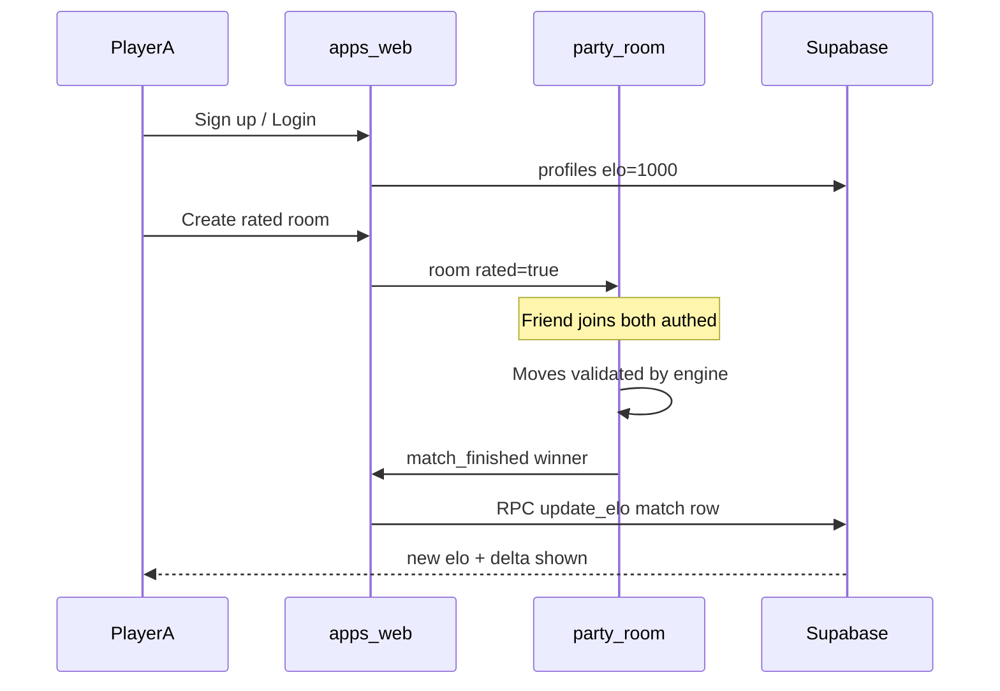
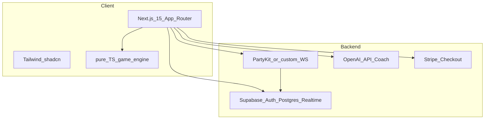
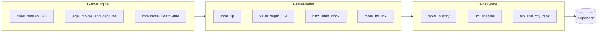
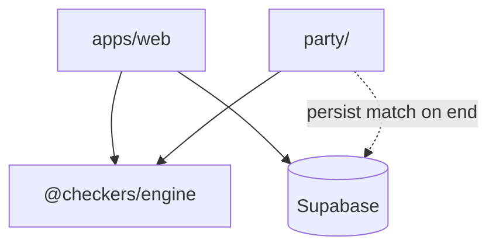
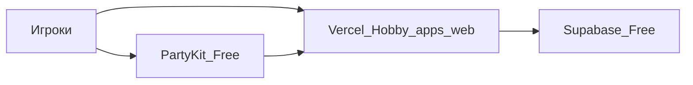

# Blitz Checkers — план уровня «Великий»

Репозиторий сейчас пустой ([README.md](README.md)). Строим продукт с нуля под **русские шашки 8×8** и нишу **гибрид: blitz-дуэли (3 мин) + AI Coach**.

## Продуктовая идея (дифференциация)

| Конкуренты | Наш угол |
|------------|----------|
| Обычные сайты шашек | **Blitz-only режим** по умолчанию: таймер 3:00, быстрый рематч, рейтинг |
| Просто «играть с другом» | **Ссылка-приглашение** + синхронизация ходов в реальном времени |
| Без обучения | **AI Coach после партии**: разбор пропущенных взятий, ошибок с дамкой, критических моментов |
| Глобальный рейтинг | **Лидерборд по городам** (Алматы, Астана и т.д.) |
| Нет монетизации | **Pro** (безлимитный Coach, премиум-скины) + Stripe Checkout |

**Позиционирование:** «Тренируй тактику за 3 минуты — сыграй blitz, получи разбор от AI».

---

## Ядро продукта (приоритет): регистрация + multiplayer + Elo

Три обязательные связки, без которых продукт не считается готовым:



### Регистрация и профиль

| Шаг | Реализация |
|-----|------------|
| Sign up | Supabase Auth: **email+password** и/или **Google OAuth** |
| Профиль | Триггер `on auth.users insert` → строка в `profiles` |
| Стартовый рейтинг | `elo INTEGER NOT NULL DEFAULT 1000` |
| Onboarding | `username` (unique), опционально `city` для лидерборда |
| Сессия | `@supabase/ssr` + middleware: защищённые `/play/*` (rated), `/history` |

**Гость без аккаунта:** может смотреть landing; **рейтинговая игра только для залогиненных** (оба игрока в комнате с `user_id`).

Файлы: `features/auth/` — формы, `shared/lib/supabase/`, `app/(account)/auth/`.

### Multiplayer (рейтинговый)

| Сценарий | URL | Rated |
|----------|-----|-------|
| Пригласить друга | `/play/[roomId]` — share link | Да, если оба auth |
| Быстрый rematch | та же комната или новый `roomId` | Да |

**PartyKit room state:**

```ts
type RoomState = {
  roomId: string
  rated: boolean
  white: { userId: string; elo: number } | null
  black: { userId: string; elo: number } | null
  boardState: BoardState
  clocks: { whiteMs: number; blackMs: number }
  status: 'waiting' | 'playing' | 'finished'
  matchId?: string          // после старта — id в Supabase
}
```

**Правила комнаты:**
1. Хост создаёт комнату → API создаёт `matches` (status=`waiting`, `rated=true`).
2. Гость переходит по ссылке → PartyKit `join`, слот black; оба ready → `playing`.
3. Каждый `move` валидируется `@checkers/engine` на сервере.
4. Конец: мат / сдача / время → PartyKit вызывает **Next API** `POST /api/matches/[id]/finish` → пересчёт Elo, запись в БД.

Локальная 2P / vs AI — **без изменения Elo** (`rated=false`).

### Система рейтинга Elo

**Один рейтинг на игрока** — поле `profiles.elo`, по умолчанию **1000**.

**Когда меняется:** только завершённые **рейтинговые** PvP-партии (multiplayer, оба `profiles.id` известны).

**Формула** (стандартная, K=32):

```
E_a = 1 / (1 + 10^((R_b - R_a) / 400))
R_a_new = R_a + K * (S_a - E_a)    // S_a: 1 победа, 0.5 ничья, 0 поражение
```

То же для игрока B (симметрично). Округление: `ROUND(R_new)` до целого.

**Пакет:** `apps/web/src/shared/lib/elo.ts` (чистые функции + unit-тесты):

```ts
calculateEloChange(ratingA, ratingB, scoreA): { newA, newB, deltaA, deltaB }
// scoreA: 1 | 0.5 | 0
```

**Атомарное обновление в БД** — Postgres function `finish_rated_match(match_id)`:

1. Заблокировать `matches` row (`FOR UPDATE`).
2. Прочитать `winner_id`, `white_id`, `black_id`, текущие `elo` из `profiles`.
3. Посчитать дельты, обновить `profiles.elo`, `matches.white_elo_after`, `black_elo_after`.
4. Вставить строки в `rating_history` (аудит).
5. Инкремент `wins` / `losses` / `draws` у профилей.

**UI после партии:** модалка «+18 Elo → 1018» / «−15 Elo → 985», ссылка на `/history`.

### Расширенная схема (рейтинг + матчи)

```sql
profiles (
  id uuid PK references auth.users,
  username text unique,
  city text,
  elo int not null default 1000,
  wins int default 0,
  losses int default 0,
  draws int default 0,
  ...
)

matches (
  id uuid PK,
  room_id text,
  white_id uuid references profiles,
  black_id uuid references profiles,
  rated boolean default true,
  status text,  -- waiting | active | finished
  winner_id uuid,
  ended_reason text,  -- checkmate | resign | timeout | draw
  white_elo_before int,
  black_elo_before int,
  white_elo_delta int,
  black_elo_delta int,
  ...
)

rating_history (
  id uuid PK,
  match_id uuid references matches,
  user_id uuid references profiles,
  elo_before int,
  elo_after int,
  delta int,
  created_at timestamptz
)
```

### Feature-модули под ядро

```
features/auth/       — login, signup, onboarding
features/multiplayer/ — usePartyRoom, ShareLink, room lobby
features/rating/      — EloBadge, PostGameRatingModal, leaderboard row
```

### Критерии приёмки (ядро)

- [ ] Новый пользователь после регистрации видит **1000 Elo** в профиле/header
- [ ] Два залогиненных игрока играют по ссылке в real-time
- [ ] Победитель получает **+Δ**, проигравший **−Δ** (сумма около нуля с учётом округления)
- [ ] Ничья (если реализована) — ~0 Δ для обоих при равных Elo
- [ ] История матча сохраняется; в `rating_history` есть запись
- [ ] Локальная / AI игра **не** меняет Elo

---

## Технологический стек



| Слой | Выбор | Зачем |
|------|--------|--------|
| Frontend | **Next.js 15** + TypeScript + **Tailwind** + **shadcn/ui** | SSR, API routes, быстрый UI |
| Game logic | **`@checkers/engine`** (pnpm package) | Тесты без React; общий код для web и PartyKit |
| DB / Auth | **Supabase** | Auth, профили, партии, рейтинг, RLS |
| Realtime MP | **PartyKit** (рекомендуется) или **Socket.io** на Fly/Railway | Комнаты по ссылке, низкая задержка |
| AI opponent | **Minimax + alpha-beta** + depth по уровню | Офлайн, без API-стоимости |
| AI Coach | **OpenAI** (structured JSON) | Пост-игровый разбор на русском |
| Payments | **Stripe** Checkout + Customer Portal | Pro + разовые скины |
| Deploy | **Vercel Hobby** + **Supabase Free** + **PartyKit Free** (см. ниже) | $0 для демо/хакатона |

---

## Архитектура модулей



### 1. Игровой движок (ядро)

Файлы: `packages/engine/` — без React-зависимостей.

**Русские шашки — обязательная логика:**
- Ход только по тёмным клеткам по диагонали
- Обязательное взятие; при нескольких вариантах — **максимальное** число сбитых фигур (стандарт для русских)
- Мульти-взятие одной фигурой за ход
- Превращение в дамку на последней горизонтали (в т.ч. в середине серии взятий — по правилам варианта; зафиксировать в `RULES.md` в коде как константы)
- Дамка: ход и взятие на любое расстояние по диагонали
- Конец игры: нет ходов / сдача / время в blitz

Публичный API движка (пример):

```ts
type BoardState = { board: Cell[][]; turn: 'w' | 'b'; ... }
getLegalMoves(state): Move[]
applyMove(state, move): BoardState
isGameOver(state): { winner?, reason }
```

Unit-тесты: **Vitest** — позиции с обязательным взятием, цепочки, дамка, пат.

### 2. UI доски

- `apps/web/src/features/board/components/CheckersBoard.tsx` — 8×8, drag-and-drop или click-from / click-to
- Подсветка: легальные ходы, обязательные взятия, последний ход
- **Подсказки** (Strong+): кнопка «Подсказка» → один лучший ход (тот же minimax depth 2)
- **Темы**: light/dark/system через `next-themes` + CSS variables для клеток и фигур
- **Скины фигур**: CSS/SVG наборы; Pro-скины из Stripe entitlements

### 3. Режимы игры

| Режим | Описание |
|-------|----------|
| Локально 2P | Hot-seat на одном устройстве |
| vs AI | Уровни 1–4 = depth 2/4/6/8 minimax |
| **Blitz** | 3:00 на игрока, increment опционально 0; проигрыш по времени |
| **По ссылке** | `/play/[roomId]` — хост создаёт, гость по invite |

**Blitz flow (rated multiplayer):**
1. Залогиненный хост → «Играть Blitz» → API: `matches` (`rated=true`, `status=waiting`, `room_id`)
2. Гость по ссылке → PartyKit join → старт, таймер 3:00, ходы в `moves`
3. Финиш → `finish_rated_match` → новый `elo` у обоих → модалка Δ Elo → опционально Coach

### 4. Мультиплеер по ссылке (WebSockets)

**PartyKit room** `party/checkers-room.ts`:
- События: `join`, `move`, `resign`, `sync_state`, `clock_tick`
- Сервер хранит authoritative `BoardState`; клиент только предлагает ход, сервер валидирует через engine
- Reconnect: при `join` отдаётся полный state + move history

**Ссылка:** `https://app.example.com/play/abc123` — `roomId` = nanoid.

Альтернатива без отдельного WS-хоста: Supabase Realtime broadcast (проще deploy, чуть хуже для sub-100ms blitz) — в плане заложить PartyKit, fallback документировать.

### 5. Supabase — схема данных

```sql
-- profiles (extends auth.users) — elo DEFAULT 1000
profiles: id, username, city, avatar_url, elo, wins, losses, draws, is_pro, stripe_customer_id

-- matches — rated PvP обновляет elo через finish_rated_match()
matches: id, room_id, white_id, black_id, rated, mode, status, winner_id,
         ended_reason, white_elo_before, black_elo_before, white_elo_delta, black_elo_delta,
         fen_or_json_state, created_at

-- rating_history — аудит каждого изменения рейтинга
rating_history: id, match_id, user_id, elo_before, elo_after, delta, created_at

-- moves
moves: id, match_id, ply, notation, board_snapshot_json, created_at

-- coach_reports
coach_reports: id, match_id, user_id, summary_ru, moments_json, created_at

-- leaderboards (materialized view или nightly)
city_stats: city, player_count, top_elo — view на profiles
```

**RLS:** пользователь читает свои партии; публичный лидерборд — read-only view; запись moves только через service role / edge function с проверкой.

### 6. Авторизация и прогресс

- Supabase Auth: email + OAuth (Google)
- Onboarding: username + **город** (select + «другое») для лидерборда
- LocalStorage: черновик незавершённой локальной партии (Strong requirement)
- Cloud: история партий; **Elo старт 1000**, меняется только после rated PvP
- Header: бейдж `features/rating/EloBadge` — текущий рейтинг

### 7. AI Coach (дифференциатор)

**После партии** (`/match/[id]/review`):

1. Собрать `moments`: каждый ход — FEN/JSON, `legalMoves`, `playedMove`, `engineEval` (difficulty depth 4)
2. Найти **критические моменты** эвристикой: потеря материала, пропуск multi-capture, eval swing > threshold
3. Отправить в LLM **структурированный prompt** → JSON:

```json
{
  "headline": "Вы упустили двойное взятие на 12-м ходу",
  "moments": [
    { "ply": 12, "type": "missed_capture", "text": "..." }
  ]
}
```

4. UI: timeline ходов + карточки Coach с стрелками на доске

**Лимиты:** Free — 1 разбор/день; Pro — безлимит (проверка в API route).

### 8. Социальный слой

- `/leaderboard` — табы: Global | по городу (фильтр `city`)
- Карточка игрока: `elo`, W/L/D, город; сортировка по `elo DESC`
- Опционально v2: друзья, challenges

### 9. Монетизация (Stripe)

- **Pro subscription** (`price_...` monthly): безлимит Coach, премиум-скины, badge
- **Skins** one-time Checkout
- UI: кнопка **«Upgrade to Pro»** в header + paywall на Coach
- Webhook `checkout.session.completed` → `profiles.is_pro` / `owned_skins[]`
- Страница `/pricing` — 3 тарифа визуально (Free / Pro / скины)

Для демо/хакатона: Stripe **test mode** + чёткая пометка «Demo».

### 10. Адаптивность

- Mobile-first: доска `max(100vw - padding, min(320px, 90vh))`
- Touch: tap piece → tap destination
- Bottom sheet для Coach и истории ходов

---

## Структура проекта (целевая)

**Решения:** pnpm monorepo + гибрид `features/` по доменам + `shared/` для переиспользуемого UI и инфраструктуры.

### Корень репозитория

```
checkers/
├── apps/
│   └── web/                          # Next.js 15 — основное приложение
├── packages/
│   └── engine/                       # @checkers/engine — чистый TS, без React/DOM
├── party/                            # PartyKit — authoritative multiplayer
├── supabase/
│   ├── migrations/
│   └── seed.sql
├── package.json                      # workspaces root
├── pnpm-workspace.yaml
└── turbo.json                        # опционально: параллельные build/test
```

### `packages/engine` — единый источник правил

Импортируется из `apps/web` и `party/` (валидация ходов на сервере).

```
packages/engine/
├── src/
│   ├── types.ts                      # BoardState, Move, Piece, Color
│   ├── board.ts                      # начальная позиция, клонирование
│   ├── moves.ts                      # getLegalMoves, applyMove
│   ├── game-over.ts
│   ├── notation.ts                   # сериализация хода для БД
│   ├── ai/
│   │   ├── minimax.ts
│   │   └── evaluate.ts
│   └── index.ts                      # публичный API пакета
├── tests/
│   ├── captures.test.ts
│   ├── king.test.ts
│   └── fixtures/                     # JSON-позиции
├── package.json                      # name: @checkers/engine
└── vitest.config.ts
```

**Правило:** никаких `import` из Next.js, Supabase, React — только чистая логика.

### `apps/web` — Next.js, гибрид по features

```
apps/web/
├── src/
│   ├── app/                          # только маршруты + layout + тонкие page wrappers
│   │   ├── (marketing)/
│   │   │   ├── page.tsx              # landing
│   │   │   └── pricing/page.tsx
│   │   ├── (game)/
│   │   │   ├── play/
│   │   │   │   ├── page.tsx          # выбор режима
│   │   │   │   ├── local/page.tsx
│   │   │   │   ├── ai/page.tsx
│   │   │   │   └── [roomId]/page.tsx # мультиплеер по ссылке
│   │   │   └── match/[id]/
│   │   │       ├── page.tsx          # просмотр партии
│   │   │       └── review/page.tsx   # AI Coach
│   │   ├── (social)/
│   │   │   └── leaderboard/page.tsx
│   │   ├── (account)/
│   │   │   ├── history/page.tsx
│   │   │   ├── settings/page.tsx
│   │   │   └── auth/callback/route.ts
│   │   ├── api/
│   │   │   ├── coach/route.ts
│   │   │   └── stripe/webhook/route.ts
│   │   ├── layout.tsx
│   │   └── providers.tsx
│   │
│   ├── features/                     # доменная логика + UI фичи
│   │   ├── board/
│   │   │   ├── components/           # CheckersBoard, Square, Piece
│   │   │   ├── hooks/                # useBoardInteraction, useLegalMovesHighlight
│   │   │   └── skins/                # темы фигур (CSS vars / SVG ids)
│   │   ├── game/
│   │   │   ├── hooks/                # useGameSession — обёртка над engine state
│   │   │   ├── components/           # GameControls, MoveList, ResignDialog
│   │   │   └── storage.ts            # LocalStorage resume
│   │   ├── blitz/
│   │   │   ├── hooks/                # useBlitzClock
│   │   │   └── components/           # ClockDisplay, BlitzLobby
│   │   ├── multiplayer/
│   │   │   ├── hooks/                # usePartyRoom — WS sync
│   │   │   └── components/           # ShareLink, OpponentStatus
│   │   ├── coach/
│   │   │   ├── lib/                  # detectCriticalMoments (использует engine)
│   │   │   └── components/         # CoachTimeline, MomentCard
│   │   ├── auth/
│   │   │   ├── components/
│   │   │   └── actions.ts            # server actions: update profile, city
│   │   ├── leaderboard/
│   │   │   └── components/
│   │   ├── rating/
│   │   │   ├── components/           # EloBadge, PostGameRatingModal
│   │   │   └── lib/                  # re-export или thin wrapper над shared/lib/elo
│   │   └── billing/
│   │       ├── components/           # UpgradeButton, Paywall
│   │       └── actions.ts            # createCheckoutSession
│   │
│   └── shared/                       # не привязано к одной фиче
│       ├── components/ui/            # shadcn
│       ├── components/layout/        # Header, Footer, ThemeToggle
│       ├── lib/
│       │   ├── elo.ts                # calculateEloChange — unit-tested
│       │   ├── supabase/
│       │   │   ├── client.ts
│       │   │   ├── server.ts
│       │   │   └── middleware.ts
│       │   └── stripe.ts
│       ├── hooks/                    # useMediaQuery, useUser
│       └── types/
│           └── database.ts           # generated Supabase types
│
├── public/skins/
├── next.config.ts                    # transpilePackages: ['@checkers/engine']
└── package.json
```

**Правила гибрида:**
- `app/` — только routing, metadata, compose features (без тяжёлой логики).
- `features/X` — всё, что знает про «игру», «blitz», «coach»; может импортировать `@checkers/engine` и `shared/`.
- `shared/` — UI-kit, Supabase, Stripe; **не** импортирует из `features/`.
- Cross-feature зависимости: через `shared` или узкий публичный API (`features/board` экспортирует только `CheckersBoard`).

### `party/` — realtime-сервер

```
party/
├── src/
│   └── checkers-room.ts              # PartyKit Server, импорт @checkers/engine
├── partykit.json
└── package.json
```

События: `join | move | resign | sync`. Состояние комнаты: `{ boardState, clocks, moveSeq, playerIds }`.

### `supabase/`

```
supabase/
├── migrations/
│   ├── 001_profiles.sql
│   ├── 002_matches_moves.sql
│   ├── 003_coach_reports.sql
│   └── 004_leaderboard_views.sql
└── config.toml
```

### Зависимости между пакетами



### Workspace `package.json` (скелет)

```yaml
# pnpm-workspace.yaml
packages:
  - "apps/*"
  - "packages/*"
  - "party"
```

```json
// packages/engine/package.json
{ "name": "@checkers/engine", "main": "./src/index.ts", "types": "./src/index.ts" }
```

### Что сознательно НЕ выносим в отдельные пакеты (пока)

| Модуль | Почему остаётся в `apps/web` |
|--------|------------------------------|
| Supabase clients | привязан к Next server/client |
| Coach LLM prompt | один consumer, API route в web |
| UI / shadcn | только фронт |
| Stripe | webhook в `app/api` |

При росте можно выделить `packages/coach-core` (детектор моментов без LLM) — уже переиспользуется в API и тестах.

### Скрипты корня

```json
"dev": "pnpm --parallel -r dev",
"dev:web": "pnpm --filter web dev",
"dev:party": "pnpm --filter party dev",
"test": "pnpm --filter @checkers/engine test",
"db:types": "supabase gen types --local > apps/web/src/shared/types/database.ts"
```

---

## Фазы реализации (порядок для time-box)

Приоритет сдвинут под **auth → multiplayer → Elo**; Coach/Stripe — после работающего rated PvP.

### Фаза A — Фундамент (~25%)
- pnpm monorepo scaffold
- `@checkers/engine` + Vitest
- Доска + локальная 2P (без рейтинга) + dark/light

### Фаза B — Auth + профиль + Elo в БД (~20%)
- Supabase Auth (email + Google)
- Trigger: `profiles.elo = 1000` при регистрации
- Onboarding username, `EloBadge` в header
- Migrations: `profiles`, `matches`, `rating_history`, RPC `finish_rated_match`
- `shared/lib/elo.ts` + тесты формулы

### Фаза C — Multiplayer rated (~25%) — **главная фаза**
- PartyKit room + share link `/play/[roomId]`
- Оба игрока auth; сохранение `moves`
- Blitz 3:00 + finиш → API → пересчёт Elo + `PostGameRatingModal`
- `/history` — список партий с Δ elo

### Фаза D — Доп. режимы (~15%)
- vs AI (4 уровня, **без Elo**)
- LocalStorage resume локальной игры
- Подсказка хода
- `/leaderboard` по `elo`

### Фаза E — AI Coach + polish (~15%)
- Critical moments detector
- OpenAI API route + review UI
- Leaderboard by city

### Фаза F — Monetization + polish (~10%)
- Stripe Checkout + webhook
- Pro paywall + skins
- Landing: value prop blitz + coach
- Deploy Vercel + PartyKit

---

## Ключевые риски и митигация

| Риск | Митигация |
|------|-----------|
| Сложность правил (макс. взятие) | Тесты из известных позиций; эталонные JSON fixtures |
| Рассинхрон MP | Authoritative server state; idempotent `move` seq |
| Стоимость LLM | Кэш `coach_reports`; только critical plies в prompt |
| Stripe на демо | Test keys + mock «Pro» toggle в dev |

---

## Бесплатный деплой ($0 для MVP)

Рекомендуемый стек «всё бесплатно» под наш monorepo:



| Сервис | Что хостим | Free tier | Ограничения |
|--------|------------|-----------|-------------|
| **[Vercel](https://vercel.com)** Hobby | `apps/web` (Next.js) | Бесплатно для личных/некоммерческих проектов | Лимиты на invocations/bandwidth; коммерция — платный Pro |
| **[Supabase](https://supabase.com)** Free | Auth, Postgres, RLS, API | 2 проекта; ~500 MB БД; лимит egress | Проект **засыпает** после ~7 дней без активности (нужно «разбудить» в dashboard) |
| **[PartyKit](https://partykit.io)** | `party/` multiplayer | Individual tier: деплой на edge | Storage в free **сбрасывается ~24ч** — для нас ок: state в памяти комнаты + persist в Supabase при finиша |
| **GitHub** | Репозиторий + Actions CI | Public repo бесплатно | — |

**Не бесплатно (можно отключить на старте):**

| Сервис | Замена на $0 |
|--------|----------------|
| OpenAI (AI Coach) | Выключить Coach в v1 или mock-текст |
| Stripe | Test mode без реальных списаний; кнопка Pro — заглушка |

### Вариант A — рекомендуемый (как в плане)

1. `apps/web` → **Vercel**: Import GitHub repo, Root Directory = `apps/web`, Framework Preset = Next.js.
2. **Supabase**: Create project → скопировать URL/anon key → migrations из `supabase/`.
3. `party/` → **PartyKit**: `npx partykit deploy`, host в `NEXT_PUBLIC_PARTYKIT_HOST`.
4. Env в Vercel: Supabase keys, PartyKit host, `SUPABASE_SERVICE_ROLE_KEY` (только server).

### Вариант B — один провайдер меньше (без PartyKit)

Multiplayer через **Supabase Realtime** (broadcast + Postgres `matches`).  
Плюс: только Vercel + Supabase. Минус: для blitz чуть выше задержка — для хакатона допустимо.

### Альтернативы (если Vercel не подходит)

| Платформа | Next.js | Заметка |
|-----------|---------|---------|
| [Cloudflare Pages](https://pages.cloudflare.com) | Да (с ограничениями) | Бесплатно щедро; PartyKit умеет деплой на **свой** Cloudflare account |
| [Netlify](https://netlify.com) | Да | Free tier для статики/SSR |
| [Railway](https://railway.app) | Да | Ограниченные free credits (меняются) — лучше не как primary |

PartyKit **Commercial free on Cloudflare**: деплой party на свой CF Workers — платишь только usage Cloudflare (часто ~$0 на малых нагрузках).

### Чеклист первого деплоя

1. GitHub push monorepo  
2. Supabase project + `supabase db push` (или SQL migrations в UI)  
3. Vercel connect → env vars  
4. PartyKit deploy → добавить host в Vercel env  
5. Supabase Auth → Redirect URLs: `https://your-app.vercel.app/**`  
6. Smoke test: регистрация → 1000 Elo → комната → партия → Δ Elo  

### Домен

Бесплатно: `*.vercel.app`. Свой домен — можно бесплатно привязать в Vercel, если домен уже куплен.

---

## Env variables

```
NEXT_PUBLIC_SUPABASE_URL
NEXT_PUBLIC_SUPABASE_ANON_KEY
SUPABASE_SERVICE_ROLE_KEY
OPENAI_API_KEY
STRIPE_SECRET_KEY
STRIPE_WEBHOOK_SECRET
NEXT_PUBLIC_STRIPE_PUBLISHABLE_KEY
NEXT_PUBLIC_PARTYKIT_HOST
```

---

## Критерии готовности «Великий»

- [ ] Регистрация; новый игрок видит **1000 Elo**
- [ ] Rated multiplayer по ссылке; Elo ± после win/loss
- [ ] `rating_history` и отображение Δ в истории
- [ ] Blitz 3 мин в rated-режиме
- [ ] Игра по ссылке в real-time (WS)
- [ ] AI Coach на русском с привязкой к ходам на доске
- [ ] Лидерборд с фильтром по городу
- [ ] Auth + облачная история
- [ ] vs AI 4 уровня + подсказки
- [ ] Dark/light + mobile
- [ ] Кнопка Upgrade to Pro + Stripe test checkout
- [ ] Landing объясняет нишу за 5 секунд
